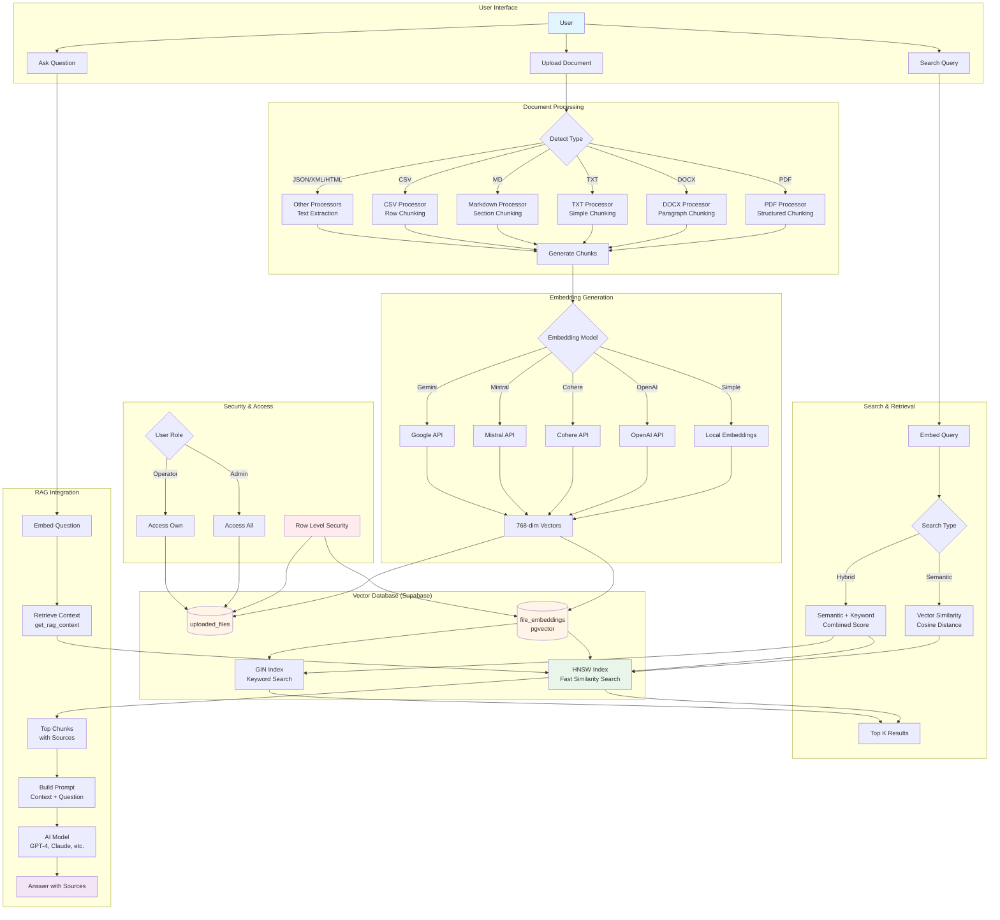

# RAG System Architecture Diagram

## Flow Description

### 1. Document Upload Flow (Blue Path)
1. User uploads document
2. System detects document type (PDF, DOCX, TXT, etc.)
3. Appropriate processor handles the file
4. Text is extracted and chunked using type-specific strategy
5. Chunks are sent to embedding generation

### 2. Embedding Generation (Yellow Path)
1. Each chunk is processed by selected embedding model
2. Models support: Local, OpenAI, Cohere, Mistral, Gemini
3. Generates 768-dimensional vectors
4. Vectors stored in Supabase with metadata

### 3. Storage (Orange Area)
1. **uploaded_files**: Stores file metadata and binary data
2. **file_embeddings**: Stores text chunks with vector embeddings
3. **HNSW Index**: Fast approximate nearest neighbor search
4. **GIN Index**: Full-text keyword search

### 4. Search Flow (Green Path)
1. User enters search query
2. Query is embedded using same model
3. Two search types available:
   - **Semantic**: Pure vector similarity (cosine distance)
   - **Hybrid**: Combines semantic and keyword matching
4. Returns top K most relevant results

### 5. RAG Flow (Purple Path)
1. User asks a question
2. Question is embedded
3. System retrieves most relevant chunks from database
4. Context is assembled with source information
5. Prompt is built: System instruction + Context + Question
6. Sent to AI model (GPT-4, Claude, etc.)
7. AI responds with answer citing sources

### 6. Security (Red Area)
1. Row Level Security (RLS) enforces access control
2. Admins can access all documents
3. Operators can only access their own documents
4. Policies applied at database level

## Key Technologies

- **pgvector**: PostgreSQL extension for vector operations
- **HNSW**: Hierarchical Navigable Small World index
- **Supabase**: Backend as a Service with PostgreSQL
- **TypeScript**: Type-safe implementation
- **React**: Frontend UI components

## Performance Features

- **HNSW Indexing**: O(log n) approximate search
- **Batch Processing**: Insert embeddings in batches
- **Lazy Loading**: Initialize services on demand
- **Caching**: Reuse embedding service instances
- **Filtered Queries**: Reduce search space

## Supported Document Types

1. **PDF** - Portable Document Format
2. **DOCX** - Microsoft Word
3. **TXT** - Plain Text
4. **MD** - Markdown
5. **CSV** - Comma-Separated Values
6. **JSON** - JavaScript Object Notation
7. **XML** - Extensible Markup Language
8. **HTML** - HyperText Markup Language
